# three.js Volume Renderer

A lightweight volume renderer for [three.js](https://threejs.org/) that uses raymarching to render procedurally defined or data-driven 3D volumes in real time.


**Try the demo on GitHub pages:** [https://donitzo.github.io/three.js-volume-renderer](https://donitzo.github.io/three.js-volume-renderer)

## Description

The volume renderer is implemented as a single `VolumeRenderer` class that extends `THREE.Mesh` with a raymarching fragment shader. You can either provide your own 3D volumetric data or supply a custom function in GLSL to create complex procedural shapes or surfaces. The demo 3D volume data is the soot visibility from a smoke simulation rendered using the [Fire Dynamics Simulator](https://pages.nist.gov/fds-smv/).

The renderer works as a fullscreen postprocessing effect which renders on top of existing geometry.

The volume renderer features:

- Normal estimation for lighting.
- Depth testing.
- Color palettes with transparent cutoff range.
- Extinction coefficients for translucency.
- Rendering of static or animated 3D volume data atlas texture. This could for example be an MRI or smoke.

## Samples

Below are some sample outputs generated by different distance functions and the volumetric smoke data. Each row shows an animated view alongside its corresponding “normals” rendering..

| Name             | Animation                                                         |Normals                                                                  |
|------------------|-------------------------------------------------------------------|-------------------------------------------------------------------------|
| Soot Visibility  |                                        | 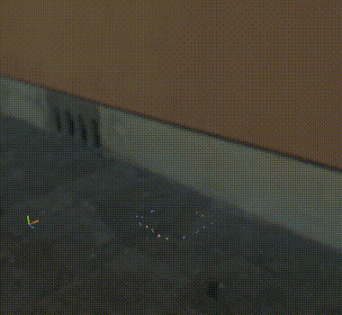                                     |
| Pulsing Sphere   |                             | 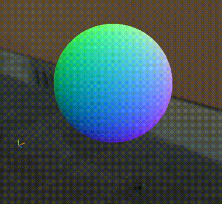                          |
| Square Sphere    | 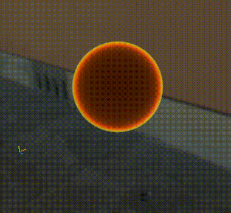                             | 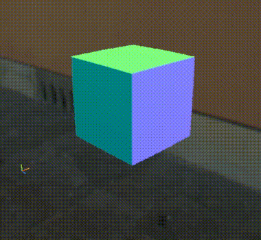                           |
| Doughnut         | 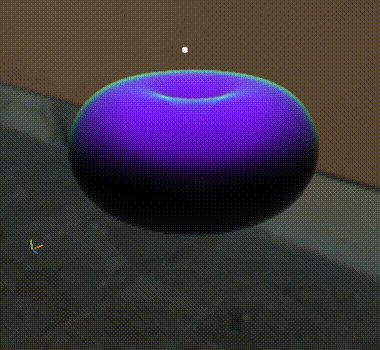                                  | 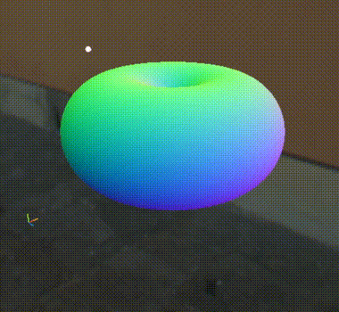                                |
| Rings            | 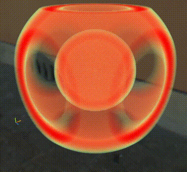                                     | 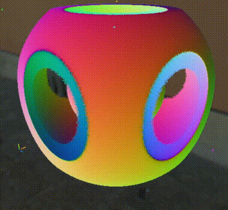                                   |
| Twister          |                                    | 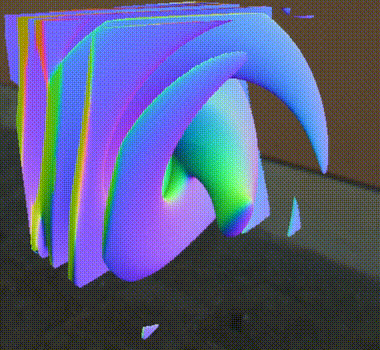                                 |
| Gyroid           | 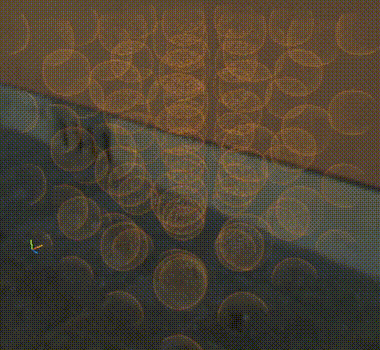                                    | 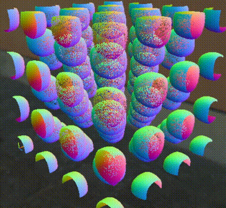                                  |
| Tunnel           | 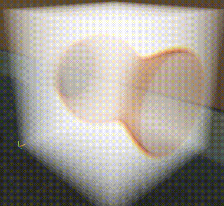                                    | 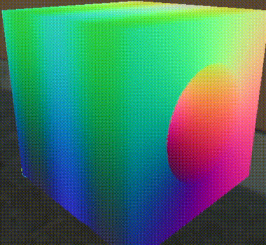                                  |
| Mandelbulb       | 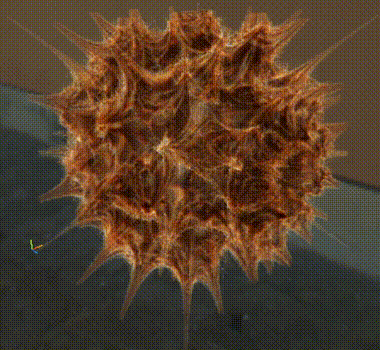                                | 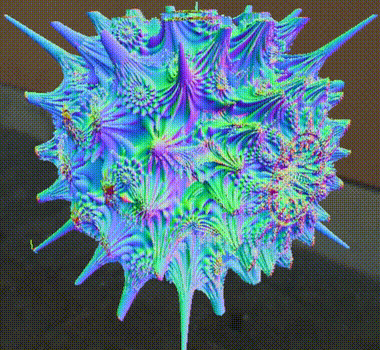                              |
| Wobbly Sphere    | 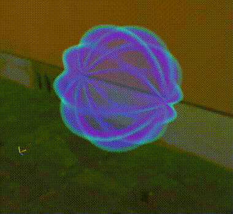                             | 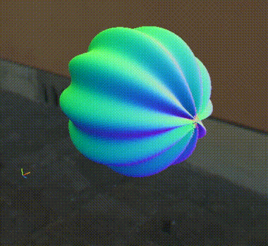                           |
| Surface          | 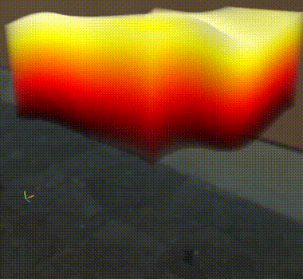                                   | 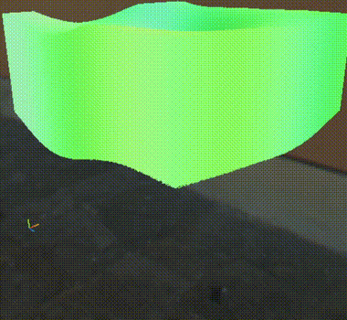                                 |
| Smoke            | 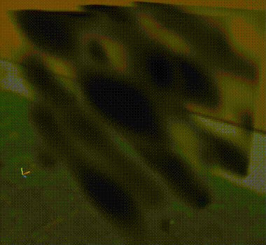                                     | 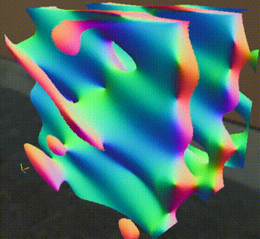                                   |

## What is Raymarching?

Raymarching is a rendering technique where, for each pixel, we cast a ray into a scene and advance it in small steps. At each step along the ray, we sample volume data (e.g. density, extinction coefficient, distance function) and accumulate it (e.g., via alpha blending or by estimating a mean value) until the ray exits the volume. Unlike surface-based raymarchers that stop at the first hit, this approach processes the entire volume along the ray.

When alpha blending is used, an extinction coefficient determines how much light is absorbed at each step, allowing you to see through semi-transparent volumes like smoke or mist. If lighting is enabled, we also estimate a normal at each step by computing the forward difference of the volume data, letting you illuminate the volume with directional or point lights for more realistic shading.

## Instructions

1. Import the VolumeRenderer (update the three.js import in the file)
   ```js
   import VolumeRenderer from './VolumeRenderer.js';
   ```

2. Add a VolumeRenderer instance to the scene
   ```js
   const volumeRenderer = new VolumeRenderer();
   scene.add(volumeRenderer);
   ```

3. Load or define volume data
   - **Option A**: Call `volumeRenderer.createAtlasTexture(...)` to set up a 3D texture for your data, then fill it with actual values using `volumeRenderer.updateAtlasTexture(...)`.  
   - **Option B**: Provide a custom distance function in `volumeRenderer.updateMaterial({ customFunction: myGLSLFunction })`.

4. Update shader defines and uniforms
   - The shader’s behavior is configured by defines, which you can set via `volumeRenderer.updateMaterial(...)`.  
   - There are many different uniforms to configure under `volumeRenderer.uniforms`. Look in the class for the documentation. 
   - Update these uniforms each frame in your main loop:
     ```js
     volumeRenderer.uniforms.time.value += dt;
     volumeRenderer.uniforms.random.value = Math.random();
     ```

## Feedback & Bug Reports

If there are additional variations you would find useful, or if you find any bugs or have other feedback, please [open an issue](https://github.com/Donitzo/three.js-volume-renderer/issues).
